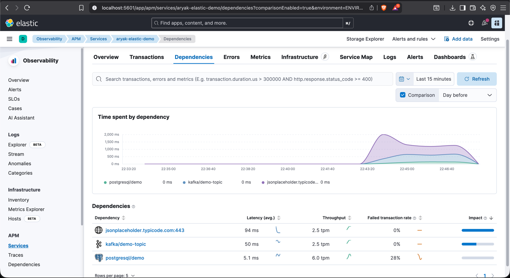
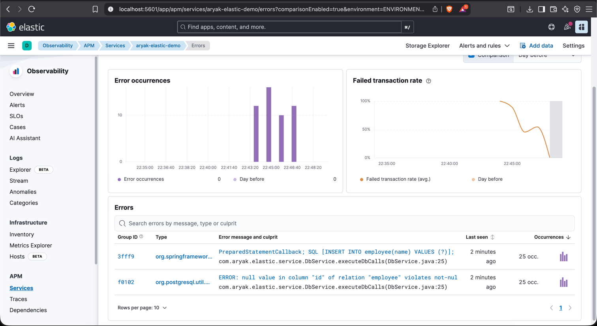
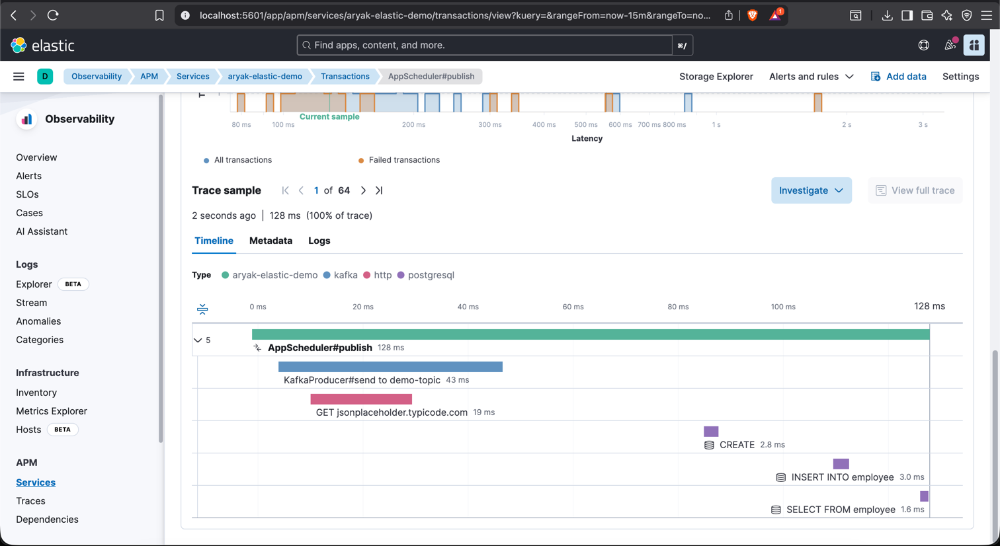

## JVM args:-

```
-javaagent:/Users/aryak/Desktop/elastic-apm-agent-1.55.6.jar
-Delastic.apm.service_name=aryak-elastic-demo
-Delastic.apm.application_packages=com.aryak.elastic
-Delastic.apm.server_url=http://127.0.0.1:8200
-Delastic.apm.log_level=TRACE
```

Screenshots of Kibana UI :





